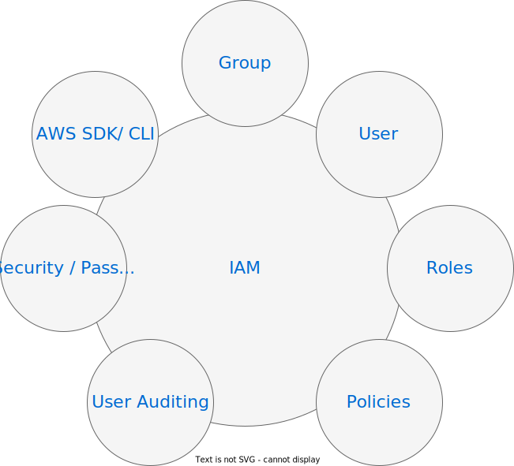

  

# AWS
Amazon Web Services offers reliable, scalable, and inexpensive cloud computing services. Free to join, pay only for what you use. This blog will help you understand different services and resources that aws provides. This is incomplete, currently contains content that I have learned so far, I will update this from time to time.

# IAM
Identity and access management is a we service of aws which helps us to manage aws resources and let us define who and upto what limit they can access or use allocated aws resource under the supervision of certain rules.

## IAM Components

**Users** 
IAM provides us the capability of creating sub-users for accessing the same aws account and resources that you have, using this functionality you can create different users with different capabilities or permission for accomplishing different tasks. 

**Groups** 
A collection of IAM users is an IAM Group. It used to define rules or permission which is common for multiple users. Any user added to this group will inherit all the permission defined for that particular group. This is just for reducing administrative load.
 
**Roles** 
Roles are similar to users but in this case permission and credentials are alloted to resources or entities instead od users on aws. It is basically used to control the accessibilty of resources over other resources on aws.

**Policies** 
These are the sets of rules and permission which is used to restrict users and roles. In aws we can define rules on json format or we can use UI provided by aws.

## How users can access AWS:
- **AWS management console** (protected by password/MFA)
- **AWS Command line interface** (protected by access key)
- **AWS Software developer kit** (sdk) for programmatic accessibilty

## IAM Security and auditing
It is very important for aws users to monitor and audit its users. In IAM this can be achieved by 
- **IAM credentials reports** (account-level): A report that list all your account users and status of their credentails.
- **IAM access advisor** (user-level): Access advisor shows the service permission granted to a user and when those were last accessed.

*IAM PASSWORD POLICY - strong password means higher security, so inorder to focus on this, IAM uses passwor policy it allows aws account user to define password creation rules for its user, It provides a set of rules that user can follow in order to update password*

## IAM Guidelines and best practices

- Don't use root account except for aws account setup, in other cases try to access aws resources using sub user account with restricted permission.
- Always assign users to group and then assign polices to it.
- Create strong password policy and try to enforce the use of MFA (mutli factor authentication).
- Use access key for programmatic access (sdk/cli).
- Always audit permissions of your account using [***IAM credentials report***](#iam-security-and-auditing) and [***IAM access advisor***](#iam-security-and-auditing).

# EC2 
EC2 stands for elastic compute cloud, it is a virtual server used for running applications on aws infrastucture.
_Knowing EC2 is fundamental to understanding how cloud works_

## EC2 user data
EC2 user data is used to automate boot tasks such as installing updates, downloading common files, starting web servers.
It is basically a script which runs only once when the instance first starts.

## EC2 Instance type
The aws instances types are as follows:
1. [**General purpose instances**](#general-purpose-instances)
2. [**Compute optimized instances**](#compute-optimized-instances)
3. [**Memory optimized instances**](#memory-optimized-instances)
4. [**Storage optimized instances**](#storage-optimized-instances)
5. [**Accelerated computing instances**](#accelerated-computing-instances)

### General purpose instances
- These are the instances with balanced computational, memory and networking resources.
- It's utilized where your application does not required any enchanced optimization in any particular resource area.
- General purpose instances are utilized for small gaming servers, small data centers and for personal projects.
- Examples of general purpose instances - t2.micro, m6a instance
- Application - web server, CDN (content deliver network), development and test environment, practice and learning.

### Compute optimized instances
- These are the instances with heavy CPU computational power.
- These are employed for high scaling web server, game server, machine learning models, batch processing workloads
- Example - c5d.24large

### Memory optimized instances
- Memory optimized instances are used to compute large datasets in memory (RAM).
- Basically it is used to run application which requires a lot of memory with high performance.
- Generally deployed to run application that requires real time processing of a significant volume of data.
- Examples - R7g.medium
- Application - In memory database, big data processing

### Storage optimized instances
- These are created for workloads which requires high and fast sequential read and write access to huge database.
- Example - Im4Gn

### Accelerated computing instances
- These are utilized for applications which requires graphical computations.
- Basically used to execute specific operation more effectively than normal CPU's.
- Application - to compute floating point calculation, pattern matching, graphical processing.

***AWS Free tier offer free t2.micro general purpose instance upto the certain limit of 750 hours per month***

