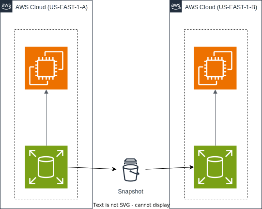

  

# AWS
Amazon Web Services offers reliable, scalable, and inexpensive cloud computing services. Free to join, pay only for what you use. This blog will help you understand different services and resources that aws provides. This is incomplete, currently contains content that I have learned so far, I will update this from time to time.

# Table of Contents

- [IAM](#iam)
  - [IAM Components](#iam-components)
  - [How users can access AWS?](#how-users-can-access-aws)
  - [IAM Security and auditing](#iam-security-and-auditing)
  - [IAM Guidelines and best practices](#iam-guidelines-and-best-practices)
- [EC2](#ec2) 
  - [EC2 user data](#ec2-user-data)
  - [EC2 Instance type](#ec2-instance-type)
  - [EC2 instance purchasing options](#ec2-instance-purchasing-options)
- [Security group](#security-group)
  - [Don't and Do's with Security groups](#dont-and-dos-with-security-groups)
- [EBS Volume](#ebs-volume)
- [EBS Snapshot](#ebs-snapshot)
- [AMI overview](#ami-overview)

# IAM
Identity and access management is a we service of aws which helps us to manage aws resources and let us define who and upto what limit they can access or use allocated aws resource under the supervision of certain rules.

## IAM Components

**Users** 
IAM provides us the capability of creating sub-users for accessing the same aws account and resources that you have, using this functionality you can create different users with different capabilities or permission for accomplishing different tasks. 

**Groups** 
A collection of IAM users is an IAM Group. It used to define rules or permission which is common for multiple users. Any user added to this group will inherit all the permission defined for that particular group. This is just for reducing administrative load.
 
**Roles** 
Roles are similar to users but in this case permission and credentials are alloted to resources or entities instead od users on aws. It is basically used to control the accessibilty of resources over other resources on aws.

**Policies** 
These are the sets of rules and permission which is used to restrict users and roles. In aws we can define rules on json format or we can use UI provided by aws.

## How users can access AWS:
- **AWS management console** (protected by password/MFA)
- **AWS Command line interface** (protected by access key)
- **AWS Software developer kit** (sdk) for programmatic accessibilty

## IAM Security and auditing
It is very important for aws users to monitor and audit its users. In IAM this can be achieved by 
- **IAM credentials reports** (account-level): A report that list all your account users and status of their credentails.
- **IAM access advisor** (user-level): Access advisor shows the service permission granted to a user and when those were last accessed.

*IAM PASSWORD POLICY - strong password means higher security, so inorder to focus on this, IAM uses passwor policy it allows aws account user to define password creation rules for its user, It provides a set of rules that user can follow in order to update password*

## IAM Guidelines and best practices

- Don't use root account except for aws account setup, in other cases try to access aws resources using sub user account with restricted permission.
- Always assign users to group and then assign polices to it.
- Create strong password policy and try to enforce the use of MFA (mutli factor authentication).
- Use access key for programmatic access (sdk/cli).
- Always audit permissions of your account using [***IAM credentials report***](#iam-security-and-auditing) and [***IAM access advisor***](#iam-security-and-auditing).

# EC2 
EC2 stands for elastic compute cloud, it is a virtual server used for running applications on aws infrastucture.
_Knowing EC2 is fundamental to understanding how cloud works_

## EC2 user data
EC2 user data is used to automate boot tasks such as installing updates, downloading common files, starting web servers.
It is basically a script which runs only once when the instance first starts.

## EC2 Instance type
The aws instances types are as follows:
1. [**General purpose instances**](#general-purpose-instances)
2. [**Compute optimized instances**](#compute-optimized-instances)
3. [**Memory optimized instances**](#memory-optimized-instances)
4. [**Storage optimized instances**](#storage-optimized-instances)
5. [**Accelerated computing instances**](#accelerated-computing-instances)

### General purpose instances
- These are the instances with balanced computational, memory and networking resources.
- It's utilized where your application does not required any enchanced optimization in any particular resource area.
- General purpose instances are utilized for small gaming servers, small data centers and for personal projects.
- Examples of general purpose instances - t2.micro, m6a instance
- Application - web server, CDN (content deliver network), development and test environment, practice and learning.

### Compute optimized instances
- These are the instances with heavy CPU computational power.
- These are employed for high scaling web server, game server, machine learning models, batch processing workloads
- Example - c5d.24large

### Memory optimized instances
- Memory optimized instances are used to compute large datasets in memory (RAM).
- Basically it is used to run application which requires a lot of memory with high performance.
- Generally deployed to run application that requires real time processing of a significant volume of data.
- Examples - R7g.medium
- Application - In memory database, big data processing

### Storage optimized instances
- These are created for workloads which requires high and fast sequential read and write access to huge database.
- Example - Im4Gn

### Accelerated computing instances
- These are utilized for applications which requires graphical computations.
- Basically used to execute specific operation more effectively than normal CPU's.
- Application - to compute floating point calculation, pattern matching, graphical processing.

***AWS Free tier offer free t2.micro general purpose instance upto the certain limit of 750 hours per month***

## EC2 instance purchasing options
Following are the purchasing options that ec2 provides for it's users -
1. [**EC2 on demand**](#ec2-on-demand)
2. [**EC2 reserved**](#ec2-reserved-instances)
3. [**Saving plans**](#ec2-saving-plans)
4. [**Scheduled reserved instances**](#general-purpose-instances)
5. [**Dedicated instances**](#dedicated-instances)
6. [**Dedicated host**](#dedicated-hosts)
7. [**Spot instances**](#spot-instances)
8. [**EC2 capacity reservations**](#general-purpose-instances)

### EC2 on demand
- Pay for what you use.
- It has highest cost but no upfront payment.
- It does not have long term commitment.

### EC2 Reserved Instances
- It helps to reduce cloud spends.
- Aws gives 72% discount on these types of instances as compared to On-demand.
- It provides discount based on committed utilization of resources for a certain period of time.
- It is the most economical option for increasing profits.
- Follow billed by hour model.
- Reserved instances are best suited if consistent heavy use is expected.
- Reserved instances are same as On-demand instances but with a heavy discount and reserved for certain period of time.
- Once purchased, the reservation cannot be cancelled but you can sell it on reserved instance marketplace.
- Payment option - no upfront, partial upfront or all upfront.
- Reserved instances has four variable that determine it's price -  instance type (t2.micro, m4.large), region, tenancy (shared(default) or single-tenant) and platform  (os- windows, linux).
- Commitment - 1 year or 3 years
- Classes - ***standard*** and ***convertible*** 
_Standard provides more discount but can be modified (within a same family) whereas convertible has lower discount rates but it can be exchanged with other convertible reserved instance with different attributes and it can also be modified._
- modification - Availability zone, instance size (within a same instance family) and scope can be modified.
- Two or more reserved instances can be merged ito single reserved instances.

### EC2 Saving plans
- It is similar to reserved instance but provides more flexibility.
- It provides dicount based on amount of money you commit to spending on aws resources per hour.
- Saving plan offer multiple location/region and usage types, when needed we can repurpose ec2 instance and transfer whole workload across instance types regardless of os and tenancy where as in reserved instances we could use reserved standard instances with various instances types but we need to have linux os and default tenancy.
- Saves upto 72% on ec2 instances as compared to on-demand ec2 instances.
- Payment - all upfront, partial upfront, no upfront.
- Commitment - 1 year or 3 year.
- After the completion of commitment if not renewed, the instances will cost as per on-demand ec2 instances.
- Aws offers three types of saving plans - ***Ec2 instance saving plan***, ***Compute saving plan*** and ***Amazon sage maker saving plan***.

### Dedicated instance
- These instances run in a VPC on hardware that's dedicated to a single customer. - The instance is physically isolated at the host hardware level from instance that belongs to other AWS accounts.
- These instances may share hardware with other instances belonging to same AWS account.
- Paying on-demand can save up to 70% by purchasing reversed instaces or can save up to 90% by purchasing spot instances.
- Generally used for security reason, because a dedicated instance will be the only resource on the server, so no one else will be able to access your server and snoop about checking out your data.

### Dedicated hosts
- Dedicated instances reserve the entire server while if we use dedicated host it allows us to reserve an entire server and run additional EC2 instances at the same time.
- Provides visibility of the number of sockets and physical cores.
- Provides additional visibilty and control over how instances are placed on a physical server.
- We can deploy our instances with different and controlled configurations.

### Spot instances
- These are those instances which are in not use, so AWS provides them to user at a discounted price due to extra capacity availability. But these comes at risk because AWS can pull these off whenever required with a 2 min timer.
- The prices varies depending upon demand.
- Can reduce cost upto 90% of on demand EC2 instance.
- Used for Machine learning, CI/CD operations, Big data, Batch scripting and training.
- Spot capacity pool - A set of unsed EC2 instances
- Spot price - The current price of a spot instance per hour/
- Spot instance request - Requests a spot instance, when capacity is available, Amazon EC2 fulfills your requests.
- Spot instance interruption - Amazon EC2 terminates, stops or hibernate your instance when Amazon needs the capacity back. Amazon provides a notice before 2 min of interrupted.

# Security group
Security group are essential part of security within the AWS ecosystem. It is used to control how traffic is allowed into or out of aws ecosystem. Basically it acts an firewall for aws. It is very important for users to understand how and when to use security group because they are directly responsible for the security of their application and it's security group in aws that helps them to achieve this.

## Don't and Do's with Security groups
- Don't allow all inbound access (0.0.0.0/0) to aws, try to restrict neccessary ip from accessing aws resources.
- Don't allow all outbound access (0.0.0.0/0) to aws, try to restrict neccessary ip from outbound access.
- Don't create security group one each for ec2 instance, try to use some strategy to combine similar usage entity into a single security group.
- Try to enforce a security group for each and every aws resources.
- Always try to restrict traffic appropriately, don't rely on default security rules.

# EBS Volume
- EBS stands for elastic store block. It is a network drive that can be attached to instances while they run.
- It allows intances to persist data even after their termination.
- EBS can be mounted to one instance at a time (at the Certified Cloud Practitioner(CCP) level). EBS can only have one instances at a time but instances can have multiple EBS attached to them at a moment.
- EBS are bound to a specific availability zone. An EBS volume in us-east-1-a cannot be attached to us-east-1-b. To move volumes across zone, you need to take a snapshot.
- It is a network drive means needs network to communicate with instance which result into latency.
- With Free tier we can use upto 30 GB per month of EBS storage of type General purpose (SSD) or magnetic. 

# EBS Snapshot
EBS snapshots are the backups for our EBS volumes taken at a point in time. These are also called incremental backup because only the blocks on device that have changed since last snapshot is taken as backups. This saves times to create snapshot and also helps to save storage cost by not duplicating data.
We can also take snapshot and can copy data across different Availability zone or region. 

# AMI overview
- AMI stands for amazon machine image.
- These are customized EC2 instance with pre installed softwares, configuration and operating system.
  - This provides faster boot/configuration time because of all pre packaged softwares and configurations.
- AMI are built for specific region but we can copy these across region.
- We can launch EC2 instance from 
  - Public AMI
  - Our own self created AMI
  - An AWS marketplace AMI
- We can create AWS AMI using followings:
  - Start an EC2 instance and customize it (add softwares, configurations etc...)
  - then stop the instance 
  - build an AMI from it, this will also create EBS snapshot.
  - now, we can start our AMI as EC2 instance.
